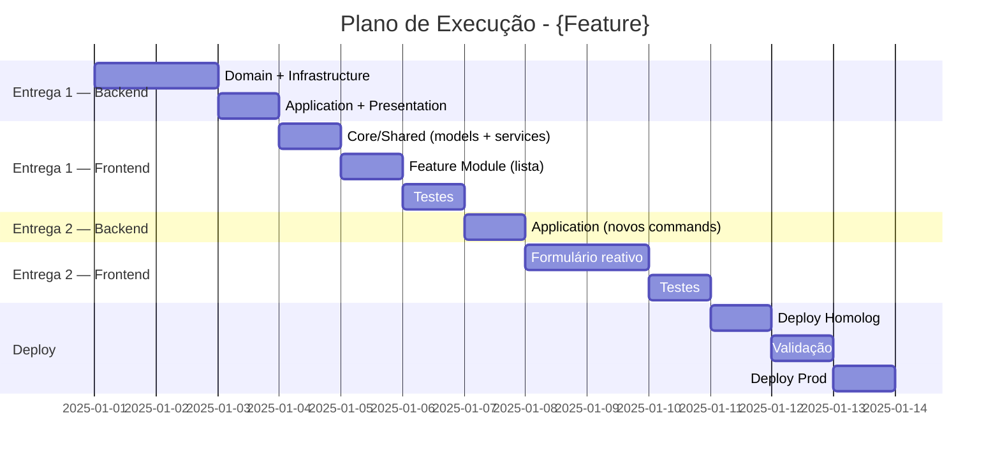

# Plan Structure

## Estrutura do Documento

O plano de execução deve ser salvo em:
```
docs/
└── execution-plans/
    └── {feature-name}/
        ├── execution-plan.md      # Plano principal
        ├── release-1.md           # Detalhamento entrega 1 (opcional)
        ├── release-2.md           # Detalhamento entrega 2 (opcional)
        └── risks.md               # Análise de riscos (opcional)
```

---

## Template: execution-plan.md

```markdown
# Plano de Execução: {Nome da Feature}

## Metadados
| Campo | Valor |
|-------|-------|
| **Especificação** | `docs/specs/{feature}/spec-functional.md` |
| **Autor** | {nome} |
| **Data** | {YYYY-MM-DD} |
| **Status** | Rascunho / Aprovado / Em Execução / Concluído |
| **Versão** | 1.0 |

---

## Resumo Executivo

### Objetivo
{Descrição breve do que será implementado e o valor entregue}

### Escopo
**Incluído:**
- {item 1 — backend}
- {item 2 — frontend}

**Não incluído:**
- {item 1}
- {item 2}

### Métricas de Sucesso
- {Critério mensurável 1}
- {Critério mensurável 2}

---

## Visão Geral das Entregas

| # | Entrega | Descrição | Estimativa | Dependência |
|---|---------|-----------|------------|-------------|
| 1 | {Nome} | {Breve descrição — backend + frontend} | {X}d | - |
| 2 | {Nome} | {Breve descrição} | {X}d | Entrega 1 |
| 3 | {Nome} | {Breve descrição} | {X}d | Entrega 2 |

**Estimativa Total:** {X} dias
**Buffer (20%):** {Y} dias
**Total com Buffer:** {Z} dias

---

## Entrega 1: {Nome da Entrega}

### Objetivo
{O que esta entrega entrega de valor isoladamente — descrever tanto o que o backend expõe quanto o que o usuário já consegue fazer na interface}

### Pré-requisitos
- {Pré-requisito 1, se houver}
- {Pré-requisito 2, se houver}

### Tarefas

#### Domain Layer
| ID | Tarefa | Tipo | Skill | Est. | Responsável |
|----|--------|------|-------|------|-------------|
| 1.1 | Criar entidade `{Entity}` | Entity | `dotnet-domain-entity` | 2h | - |
| 1.2 | Criar Value Object `{VO}` | ValueObject | `dotnet-domain-entity` | 1h | - |
| 1.3 | Criar interface `I{Entity}Repository` | Interface | `dotnet-domain-entity` | 0.5h | - |

#### Infrastructure Layer
| ID | Tarefa | Tipo | Skill | Est. | Responsável |
|----|--------|------|-------|------|-------------|
| 1.4 | Criar `{Entity}Configuration` | EF Config | - | 1h | - |
| 1.5 | Criar `{Entity}Repository` | Repository | `dotnet-infrastructure-repository` | 2h | - |
| 1.6 | Criar migration | Migration | - | 0.5h | - |

#### Application Layer
| ID | Tarefa | Tipo | Skill | Est. | Responsável |
|----|--------|------|-------|------|-------------|
| 1.7 | Criar `{Entity}Dto` | DTO | `dotnet-application-feature` | 0.5h | - |
| 1.8 | Criar `Create{Entity}Command` + Handler | Command | `dotnet-application-feature` | 3h | - |
| 1.9 | Criar `Get{Entity}ByIdQuery` + Handler | Query | `dotnet-application-feature` | 2h | - |

#### Presentation Layer
| ID | Tarefa | Tipo | Skill | Est. | Responsável |
|----|--------|------|-------|------|-------------|
| 1.10 | Criar `{Entity}Controller` | Controller | `dotnet-endpoint-generator` | 2h | - |
| 1.11 | Criar validators de request | Validator | `dotnet-endpoint-generator` | 1h | - |

#### Frontend — Core / Shared
> Criado uma única vez por feature; reutilizado por todas as entregas subsequentes.

| ID | Tarefa | Tipo | Est. | Responsável |
|----|--------|------|------|-------------|
| 1.12 | Criar model `{Entity}` (espelha DTO) | Interface TS | 0.5h | - |
| 1.13 | Criar `{Entity}Service` (HttpClient) | Service | 2h | - |
| 1.14 | Criar `{Entity}StateService` (BehaviorSubject) | State Service | 2h | - |

#### Frontend — Feature Module
| ID | Tarefa | Tipo | Est. | Responsável |
|----|--------|------|------|-------------|
| 1.15 | Criar `{feature}.module.ts` + rota lazy | Module / Routing | 1h | - |
| 1.16 | Criar `{Entity}ListComponent` (Smart) | Component | 3h | - |
| 1.17 | Criar `{Entity}CardComponent` (Presentational) | Component | 1.5h | - |

#### Testes
| ID | Tarefa | Tipo | Est. | Responsável |
|----|--------|------|------|-------------|
| 1.18 | Testes unitários Domain | Unit (.NET) | 2h | - |
| 1.19 | Testes unitários Application | Unit (.NET) | 3h | - |
| 1.20 | Testes unitários `{Entity}Service` Angular | Unit (Angular) | 1h | - |
| 1.21 | Testes unitários `{Entity}ListComponent` | Unit (Angular) | 1.5h | - |
| 1.22 | Testes de integração API | Integration | 3h | - |

### Subtotal Entrega 1
| Categoria | Estimativa |
|-----------|------------|
| Backend — Desenvolvimento | {X}h |
| Frontend — Desenvolvimento | {Y}h |
| Testes | {Z}h |
| **Total** | **{W}h** |

### Critérios de Aceite
- [ ] Endpoint POST /api/{entities} funcional (validado via Swagger)
- [ ] Endpoint GET /api/{entities}/{id} funcional
- [ ] Lista Angular exibindo dados reais da API
- [ ] Testes com cobertura > 80%
- [ ] Code review aprovado

### Validação
```bash
# Backend
curl -X POST http://localhost:5000/api/{entities} -d '{...}'
curl -X GET http://localhost:5000/api/{entities}/{id}
dotnet test --filter "Category=Entrega1"

# Frontend
ng test --include="{entity}*.spec.ts"
```

---

## Entrega 2: {Nome da Entrega}

{Repetir estrutura da Entrega 1 — incluindo seções Frontend Core/Shared (somente o que for novo) e Feature Module}

---

## Entrega 3: {Nome da Entrega}

{Repetir estrutura da Entrega 1}

---

## Cronograma

```
Semana 1: Entrega 1
├── Dia 1-2: Domain + Infrastructure + Application
├── Dia 3: Presentation (API) + validação via Swagger
├── Dia 4: Frontend Core/Shared + Feature Module (lista)
└── Dia 5: Testes + Code Review

Semana 2: Entrega 2
├── Dia 1-2: Backend (se houver) + Frontend formulário
├── Dia 3: Reactive Form + validações Angular
└── Dia 4-5: Testes + ajustes

Semana 3: Entrega 3 + Deploy
├── Dia 1-3: Entrega 3 (backend + frontend)
├── Dia 4: Deploy Homolog
└── Dia 5: Validação + Deploy Prod
```

### Diagrama de Gantt (Mermaid)



---

## Riscos e Mitigações

| Risco | Probabilidade | Impacto | Mitigação |
|-------|---------------|---------|-----------|
| {Descrição do risco} | Alta/Média/Baixa | Alto/Médio/Baixo | {Ação de mitigação} |
| Integração externa instável | Média | Alto | Circuit breaker + retry |
| Requisitos podem mudar | Média | Médio | Entregas incrementais |
| Divergência entre DTO e model Angular | Baixa | Médio | Gerar models a partir do Swagger (openapi-generator) |
| Estado global mais complexo que previsto | Média | Médio | Planejar refactoring para NgRx em entrega separada |

---

## Dependências Externas

| Dependência | Responsável | Status | Data Necessária |
|-------------|-------------|--------|-----------------|
| API de Pagamento disponível | Time Financeiro | Pendente | Semana 2 |
| Ambiente de homolog | DevOps | OK | Semana 3 |
| Design system / componentes UI aprovados | UX | Pendente | Semana 1 |

---

## Definição de Pronto (DoD)

Uma **tarefa** está "pronta" quando:
- [ ] Código implementado e funcionando localmente
- [ ] Testes unitários escritos (cobertura > 80%)
- [ ] Testes de integração (quando aplicável)
- [ ] Code review aprovado
- [ ] Sem débitos técnicos novos

Uma **entrega** está "pronta" quando:
- [ ] Todas as tarefas backend concluídas e validadas via Swagger
- [ ] Todas as tarefas frontend concluídas e integradas com a API real
- [ ] Todos os critérios de aceite validados
- [ ] Deploy em homolog bem-sucedido
- [ ] Testes de regressão passando

---

## Histórico de Revisões

| Versão | Data | Autor | Descrição |
|--------|------|-------|-----------|
| 1.0 | {data} | {autor} | Versão inicial |
| 2.0 | {data} | {autor} | Adicionado frontend Angular |
```

---

## Exemplo Preenchido

```markdown
# Plano de Execução: Gestão de Produtos

## Metadados
| Campo | Valor |
|-------|-------|
| **Especificação** | `docs/specs/products/spec-functional.md` |
| **Autor** | João Silva |
| **Data** | 2025-01-10 |
| **Status** | Aprovado |
| **Versão** | 2.0 |

---

## Resumo Executivo

### Objetivo
Implementar o módulo de gestão de produtos com CRUD completo, categorização,
controle de estoque e busca avançada — incluindo API .NET e interface Angular.

### Escopo
**Incluído:**
- CRUD de produtos (backend + frontend)
- Categorização de produtos
- Controle de estoque básico
- Busca e filtros com paginação

**Não incluído:**
- Precificação dinâmica
- Integração com ERP
- Gestão de fornecedores

---

## Visão Geral das Entregas

| # | Entrega | Descrição | Estimativa | Dependência |
|---|---------|-----------|------------|-------------|
| 1 | CRUD Básico | API CRUD + lista e formulário Angular | 4d | - |
| 2 | Categorias | Backend categorias + select no formulário Angular | 2d | Entrega 1 |
| 3 | Busca e Filtros | API paginada + filtros na lista Angular | 2d | Entrega 1 |
| 4 | Estoque | Endpoints de estoque + tela de movimentação Angular | 2d | Entrega 1 |

**Estimativa Total:** 10 dias
**Buffer (20%):** 2 dias
**Total com Buffer:** 12 dias

---

## Entrega 1: CRUD Básico

### Objetivo
Permitir criar, visualizar, atualizar e excluir produtos — com API funcional
e interface Angular exibindo a lista e o formulário integrados com dados reais.

### Tarefas

#### Domain Layer
| ID | Tarefa | Tipo | Skill | Est. |
|----|--------|------|-------|------|
| 1.1 | Criar Value Object `Money` | ValueObject | `dotnet-domain-entity` | 1h |
| 1.2 | Criar entidade `Product` | Entity | `dotnet-domain-entity` | 2h |
| 1.3 | Criar interface `IProductRepository` | Interface | `dotnet-domain-entity` | 0.5h |

#### Infrastructure Layer
| ID | Tarefa | Tipo | Skill | Est. |
|----|--------|------|-------|------|
| 1.4 | Criar `ProductConfiguration` | EF Config | - | 1h |
| 1.5 | Criar `ProductRepository` | Repository | `dotnet-infrastructure-repository` | 2h |
| 1.6 | Criar migration inicial | Migration | - | 0.5h |

#### Application Layer
| ID | Tarefa | Tipo | Skill | Est. |
|----|--------|------|-------|------|
| 1.7 | Criar `ProductDto` | DTO | `dotnet-application-feature` | 0.5h |
| 1.8 | Criar `CreateProductCommand` | Command | `dotnet-application-feature` | 2h |
| 1.9 | Criar `UpdateProductCommand` | Command | `dotnet-application-feature` | 2h |
| 1.10 | Criar `DeleteProductCommand` | Command | `dotnet-application-feature` | 1h |
| 1.11 | Criar `GetProductByIdQuery` | Query | `dotnet-application-feature` | 1.5h |
| 1.12 | Criar `GetProductListQuery` | Query | `dotnet-application-feature` | 1.5h |

#### Presentation Layer
| ID | Tarefa | Tipo | Skill | Est. |
|----|--------|------|-------|------|
| 1.13 | Criar `ProductsController` | Controller | `dotnet-endpoint-generator` | 3h |
| 1.14 | Criar Request Validators | Validator | `dotnet-endpoint-generator` | 1h |

#### Frontend — Core / Shared
| ID | Tarefa | Tipo | Est. |
|----|--------|------|------|
| 1.15 | Criar model `Product` (espelha `ProductDto`) | Interface TS | 0.5h |
| 1.16 | Criar `ProductService` com HttpClient (GET, POST, PUT, DELETE) | Service | 3h |
| 1.17 | Criar `ProductStateService` com BehaviorSubject | State Service | 2h |

#### Frontend — Feature Module
| ID | Tarefa | Tipo | Est. |
|----|--------|------|------|
| 1.18 | Criar `products.module.ts` + rota lazy `/products` | Module / Routing | 1h |
| 1.19 | Criar `ProductListComponent` (Smart — injeta StateService) | Component | 3h |
| 1.20 | Criar `ProductCardComponent` (Presentational — OnPush) | Component | 1.5h |
| 1.21 | Criar `ProductFormComponent` com Reactive Form | Component | 4h |

#### Testes
| ID | Tarefa | Tipo | Est. |
|----|--------|------|------|
| 1.22 | Testes unitários Domain (`Product`, `Money`) | Unit (.NET) | 2h |
| 1.23 | Testes unitários Handlers | Unit (.NET) | 3h |
| 1.24 | Testes unitários `ProductService` Angular | Unit (Angular) | 1.5h |
| 1.25 | Testes unitários `ProductListComponent` | Unit (Angular) | 1.5h |
| 1.26 | Testes integração API | Integration | 2h |

### Subtotal Entrega 1
| Categoria | Estimativa |
|-----------|------------|
| Backend — Desenvolvimento | 18h |
| Frontend — Desenvolvimento | 15h |
| Testes | 10h |
| **Total** | **43h (~4 dias com 2 devs)** |

### Critérios de Aceite
- [ ] GET /api/products retorna lista de produtos
- [ ] POST /api/products cria produto com validações
- [ ] PUT /api/products/{id} atualiza produto
- [ ] DELETE /api/products/{id} remove produto
- [ ] Lista Angular exibindo produtos reais da API
- [ ] Formulário Angular criando e editando com feedback ao usuário
- [ ] Cobertura de testes > 80%
- [ ] Code review aprovado

### Validação
```bash
# Backend
curl -X GET  http://localhost:5000/api/products
curl -X POST http://localhost:5000/api/products -H "Content-Type: application/json" -d '{"name":"Produto A","price":99.90}'
curl -X PUT  http://localhost:5000/api/products/1 -H "Content-Type: application/json" -d '{"name":"Produto A Editado","price":89.90}'
dotnet test --filter "Category=Entrega1"

# Frontend
ng test --include="product*.spec.ts"
ng serve  # validar fluxo completo em http://localhost:4200/products
```
```